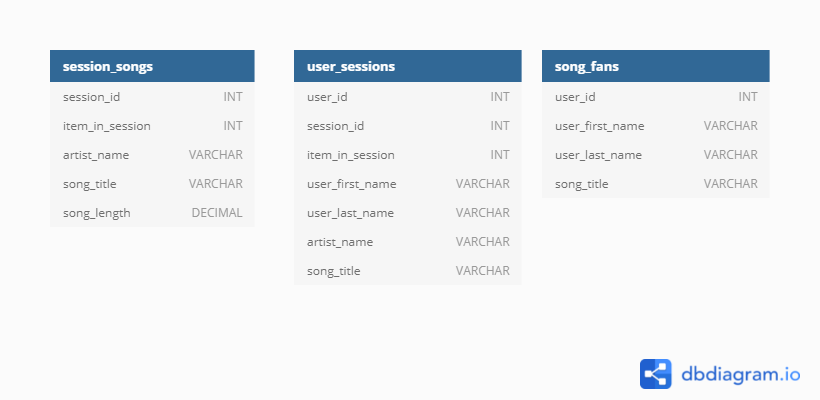

# ETL Pipeline and NoSQL Data Modeling with Apache Cassandra

> This project was a milestone in my journey to study the Data Engineer Nanodegree (provided by Udacity) which I am currently enrolled in.

## Introduction

A startup called Sparkify wants to analyze the data they've been collecting on songs and user activity on their new music streaming app. The analysis team is particularly interested in understanding what songs users are listening to. Currently, there is no easy way to query the data to generate the results, since the data reside in a directory of CSV files on user activity on the app.

They'd like a data engineer to create an Apache Cassandra database which can create queries on song play data to answer the questions, and wish to bring you on the project. Your role is to create a database for this analysis. You'll be able to test your database by running queries given to you by the analytics team from Sparkify to create the results.

## Project Description

In this project, you'll apply what you've learned on data modeling with Apache Cassandra and complete an ETL pipeline using Python. To complete the project, you will need to model your data by creating tables in Apache Cassandra to run queries. The ETL pipeline transfers data from a set of CSV files within a directory to create a streamlined CSV file to model and insert data into Apache Cassandra tables.

## Project Datasets

For this project, I worked with one dataset: `event_data`. The directory of CSV files partitioned by date. Here are examples of filepaths to two files in the dataset:

> event_data/2018-11-08-events.csv  
event_data/2018-11-09-events.csv

And below is an example of what an single event data file, `2018-11-01-events.csv`, looks like:  

## Keyspace Tables Diagram

## About The Author

* Author: Mohamed Abdel-Gawad Ibrahim
* Contact: muhammadabdelgawwad@gmail.com
* Phone: +201069052620 | +201147821232
